# Architecture

## System Overview

The IDP Backend is a multi-tenant internal developer platform that catalogs repositories across GitHub and GitLab, enables AI-powered documentation generation, tracks code coverage, and provides spatial relationship mapping. It serves as a central hub for repository discovery, collaboration intelligence, and organizational onboarding.

## Component Diagram

```mermaid
graph TB
    subgraph "HTTP Layer"
        GIN["Gin Web Server<br/>(Port 3000)"]
        SWAGGER["Swagger/OpenAPI<br/>Documentation"]
    end

    subgraph "API Routes"
        AUTH["Auth Routes<br/>(register, login, OAuth)"]
        REPO["Repository Routes<br/>(CRUD, sync, webhooks)"]
        COVERAGE["Coverage Routes<br/>(upload, tokens)"]
        DOCS["Documentation Routes<br/>(generate, edit)"]
        RELATIONSHIPS["Relationship Routes<br/>(graph, CRUD)"]
        TEAMS["Teams Routes<br/>(CRUD, members)"]
        ONBOARDING["Onboarding Routes<br/>(flows, progress)"]
    end

    subgraph "Service Layer"
        AUTHSVC["Auth Service<br/>(JWT, OAuth, encryption)"]
        REPOSVC["Repository Service<br/>(sync, caching)"]
        COVSVC["Coverage Service<br/>(parsing, storage)"]
        DOCSVC["Documentation Service<br/>(generation pipeline)"]
        RELSVC["Relationship Service<br/>(graph queries)"]
        TEAMSVC["Teams Service<br/>(membership, imports)"]
        ONBOARDSVC["Onboarding Service<br/>(flow execution)"]
    end

    subgraph "Integration Layer"
        GITHUB["GitHub Provider<br/>(API client, webhooks)"]
        GITLAB["GitLab Provider<br/>(API client, webhooks)"]
        AI["Anthropic AI<br/>(Claude, doc generation)"]
    end

    subgraph "Job Queue & Background Workers"
        ASYNQ["Asynq Task Queue<br/>(Redis-backed)"]
        SYNCWORKER["Sync Worker<br/>(repo:sync tasks)"]
        WEBHOOKWORKER["Webhook Worker<br/>(webhook:process tasks)"]
        DOCSWORKER["Docs Worker<br/>(docs:generate tasks)"]
    end

    subgraph "Cache & Storage"
        REDIS["Redis<br/>(cache, job queue)"]
        POSTGRES[("PostgreSQL<br/>(primary datastore)")]
        ENCRYPTION["Encryption Layer<br/>(AES-256-GCM)"]
    end

    subgraph "Data Models"
        USERS["Users & Auth<br/>(credentials, JTI revocation)"]
        REPOS["Repositories<br/>(metadata, sync status)"]
        OAUTH["OAuth Connections<br/>(encrypted tokens)"]
        REFRESHTOKENS["Refresh Tokens<br/>(rotation, family tracking)"]
        WEBHOOKS["Webhooks<br/>(events, delivery status)"]
        COVERAGE["Coverage Uploads<br/>(per-commit stats)"]
        DOCS["Doc Generations<br/>(status, content, PR tracking)"]
        RELATIONSHIPS["Repository Relationships<br/>(graph edges, kinds)"]
        TEAMS["Teams<br/>(members, external IDs)"]
        ONBOARDINGFLOWS["Onboarding Flows<br/>(definitions, progress)"]
    end

    GIN --> AUTH
    GIN --> REPO
    GIN --> COVERAGE
    GIN --> DOCS
    GIN --> RELATIONSHIPS
    GIN --> TEAMS
    GIN --> ONBOARDING
    GIN --> SWAGGER

    AUTH --> AUTHSVC
    REPO --> REPOSVC
    COVERAGE --> COVSVC
    DOCS --> DOCSVC
    RELATIONSHIPS --> RELSVC
    TEAMS --> TEAMSVC
    ONBOARDING --> ONBOARDSVC

    AUTHSVC --> ENCRYPTION
    AUTHSVC --> POSTGRES
    AUTHSVC --> REDIS

    REPOSVC --> GITHUB
    REPOSVC --> GITLAB
    REPOSVC --> POSTGRES
    REPOSVC --> REDIS
    REPOSVC --> ASYNQ

    COVSVC --> POSTGRES

    DOCSVC --> AI
    DOCSVC --> GITHUB
    DOCSVC --> GITLAB
    DOCSVC --> POSTGRES
    DOCSVC --> ASYNQ

    RELSVC --> POSTGRES

    TEAMSVC --> GITHUB
    TEAMSVC --> GITLAB
    TEAMSVC --> POSTGRES

    ONBOARDSVC --> POSTGRES

    ASYNQ --> REDIS
    SYNCWORKER --> ASYNQ
    WEBHOOKWORKER --> ASYNQ
    DOCSWORKER --> ASYNQ

    SYNCWORKER --> GITHUB
    SYNCWORKER --> GITLAB
    SYNCWORKER --> POSTGRES

    WEBHOOKWORKER --> POSTGRES

    DOCSWORKER --> AI
    DOCSWORKER --> GITHUB
    DOCSWORKER --> GITLAB
    DOCSWORKER --> POSTGRES

    POSTGRES --> USERS
    POSTGRES --> REPOS
    POSTGRES --> OAUTH
    POSTGRES --> REFRESHTOKENS
    POSTGRES --> WEBHOOKS
    POSTGRES --> COVERAGE
    POSTGRES --> DOCS
    POSTGRES --> RELATIONSHIPS
    POSTGRES --> TEAMS
    POSTGRES --> ONBOARDINGFLOWS

    ENCRYPTION --> OAUTH

    style GIN fill:#4A90E2
    style ASYNQ fill:#F5A623
    style REDIS fill:#F5A623
    style POSTGRES fill:#50C878
    style AI fill:#BD10E0
    style ENCRYPTION fill:#FF6B6B
```

## Key Components

### HTTP & API Layer
**Gin Web Framework** serves RESTful endpoints for authentication, repositories, coverage uploads, documentation generation, spatial relationships, teams, and onboarding. All routes except health, login, register, and OAuth callback require JWT authentication. API versioning via `/api/v1` namespace. Swagger/OpenAPI documentation auto-generated from source annotations.

### Authentication & Authorization
**Auth Service** implements email/password registration (Argon2 hashing), JWT access tokens with per-token JTI revocation tracking, refresh token rotation (RFC 6749/RFC 9700 compliant) with family-based hijacking detection, and multi-organization login via short-lived selection tickets. OAuth 2.0 Authorization Code Flow integrates GitHub and GitLab using stateless HMAC-signed CSRF state tokens. Account linking bridges OAuth and email users.

### Encryption Layer
**Field-level AES-256-GCM encryption** protects sensitive data (OAuth access tokens, webhook secrets) via GORM hooks. Base64-encoded 32-byte key loaded from `ENCRYPTION_KEY`. Automatic encryption on write and decryption on read. CLI migration tool (`migrate-encrypt`) encrypts existing unencrypted records.

### Repository Management
**Repository Service** syncs metadata (branches, commits, PRs/MRs, languages, stars, forks) from GitHub or GitLab based on repository URL. Maintains sync state lifecycle: `idle → syncing → synced/error`. Registers GitHub webhooks on first sync (skipped on localhost). HMAC-SHA256 webhook signature validation ensures authenticity. Caches repository data in Redis to reduce provider API load.

### Provider Integration
**GitHub Provider** (`internal/integrations/github/`) exposes repository lookups, branch/commit fetches, PR enumeration, webhook registration, and contents API for file commits. **GitLab Provider** (`internal/integrations/gitlab/`) mirrors GitHub capabilities for GitLab instances. Both are pluggable via a common provider interface.

### Job Queue & Background Workers
**Asynq** (Redis-backed task queue) manages asynchronous work with retry policies, priority queues, and dead-letter handling. Three worker types: **Sync Worker** (asynchronously syncs repository metadata), **Webhook Worker** (processes incoming GitHub/GitLab events with idempotency), **Docs Worker** (clones repos, generates documentation via Claude, commits to branch, opens PRs). Graceful shutdown ensures in-flight tasks complete before termination.

### Documentation Generation Pipeline
**Documentation Service** orchestrates AI-powered doc generation. Enqueues `docs:generate` tasks for background processing. Clone repository → read codebase → invoke Anthropic Claude with system prompt (respects org-level language config) → parse structured Markdown → store in JSONB → commit to branch via GitHub Contents API → open pull request. Org-wide docs aggregate repository snapshots (metadata, stack dominance, relationships, existing per-repo docs). Token rate limiting enforces hourly budget (default 20K tokens/hour, configurable).

### Coverage Upload Pipeline
**Coverage Service** accepts raw coverage reports (Go cover, LCOV, Cobertura XML, JaCoCo XML) up to 5 MB via Bearer token authentication. Upload tokens (`cov_*`) are scoped per repository, hashed with SHA-256 at rest, displayed once. Each upload keyed by `(repo, commit_sha)` — multiple uploads on the same commit retain all records; newest wins. Repository list query uses LATERAL join to fetch latest coverage inline, exposing `stats.has_coverage` to distinguish "never measured" from "measured at 0%".

### Spatial Repository Navigation
**Relationship Service** maintains directed repo-to-repo relationships (kinds: `http`, `async`, `library`, `data`, `infra`, `manual`, `other`) with source and confidence metadata. Graph endpoint aggregates all organization repositories as nodes and edges in a single query. Supports manual creation and future inference from codebase analysis. Backs spatial navigation maps showing how services communicate and depend on one another.

### Teams & Membership
**Teams Service** imports team definitions from GitHub (via GitHub Orgs/Teams API) and GitLab (via GitLab Groups API) with external ID tracking to prevent duplicate imports. Exposes team membership, repositories accessible to each team, and provider login context for the calling user.

### Onboarding Flows
**Onboarding Service** manages configurable organization onboarding flows. Flows are sequential steps (welcome, install tools, connect repositories, configure CI, add team members) with verification logic. Tracks per-user progress, allows invites to assign flows, and exposes live step execution via WebSocket or polling.

### Data Layer
**PostgreSQL** (v14+) with pgvector extension stores users, repositories, OAuth connections, refresh tokens, webhooks, coverage uploads, documentation generations, repository relationships, teams, and onboarding flows. Migration tracking via `schema_migrations` table prevents re-runs. Soft deletes via `deleted_at`. Audit timestamps (`created_at`, `updated_at`) maintained by triggers. Optimized indexes for enriched queries (e.g., LATERAL joins for latest coverage per repo).

### Cache & Job Queue
**Redis** with go-redis/v9 client provides in-memory caching for frequently accessed data (user sessions, repository metadata, coverage stats) and job queue storage for Asynq. Server boots gracefully without Redis — cache and queue degrade to silent no-op, ensuring uptime during Redis outages.

## Key Technical Decisions

### Stateless JWT with JTI Revocation
Access tokens include a unique ID (JTI) stored in a revocation set. Logout invalidates all JTI values for the user; immediate effect without central session state.

### Refresh Token Rotation (RFC 9700)
New refresh tokens are issued on use; old tokens are invalidated. Detects hijacking by tracking token families — if a reused token is detected, all family members are revoked, alerting the user to potential compromise.

### Multi-Organization Login via Selection Tickets
Users belonging to multiple organizations receive a short-lived, HMAC-signed ticket to complete login after selecting an organization. Eliminates multi-step prompts for single-org users while supporting complex enterprise scenarios.

### Field-Level Encryption
Sensitive fields (OAuth tokens, webhook secrets) are encrypted at the application layer using AES-256-GCM, not at the database column level. This provides encryption in transit, at rest, and in backups without complicating indexing or querying of non-encrypted fields.

### Pluggable Provider Interface
GitHub and GitLab providers implement a common interface, allowing future provider additions (Gitea, Bitbucket) without core changes. Provider-specific logic is isolated in `internal/integrations/{provider}/`.

### Async Job Processing for Long-Running Operations
Repository sync, webhook processing, and documentation generation are queued tasks processed by background workers. This decouples API response times from slow I/O and external API latency. Asynq provides built-in retry, priority, and dead-letter queue support.

### Single-Query Enriched Repository Lists
Repository lists are enriched with latest coverage stats via a PostgreSQL LATERAL join, eliminating N+1 queries. Graph queries similarly aggregate nodes and edges in a single query.

### Transparent Coverage Ingestion
Coverage format detection is automatic (Go cover, LCOV, Cobertura XML, JaCoCo XML). Upload tokens are storage-agnostic; future backends (S3, object storage) can be added without changing the API.

### Org-Level Output Language for Generated Docs
Documentation generation respects organization-level language preference (BCP 47, validated via `golang.org/x/text/language`). The system prompt drives Claude to generate Markdown in the chosen language, making docs accessible to non-English-speaking teams.

### Graceful Degradation Without External Services
Server boots without Redis, GitHub credentials, GitLab credentials, or Anthropic API key. Cache, job queue, and documentation generation degrade to no-op; core authentication and repository browsing remain functional. This ensures partial outages do not cascade.

## Deployment Architecture

The system is containerized via Docker Compose in development and can scale to production:
- **API Server** (stateless, multi-instance ready) — routes requests to auth, repository, coverage, docs, teams, and onboarding services
- **PostgreSQL** (single instance in dev, HA cluster in production) — persistent datastore with migrations managed at startup
- **Redis** (single instance in dev, cluster in production) — caching and job queue
- **Background Workers** (one or more instances) — process sync, webhook, and docs generation tasks

Environment variables (`.env`) control database connections, OAuth credentials, encryption keys, API rate limits, and feature flags. Migrations run automatically at server startup, detecting and applying pending changes safely.